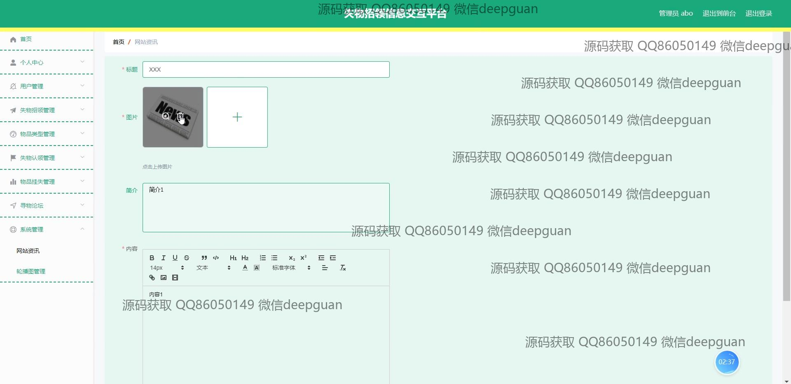
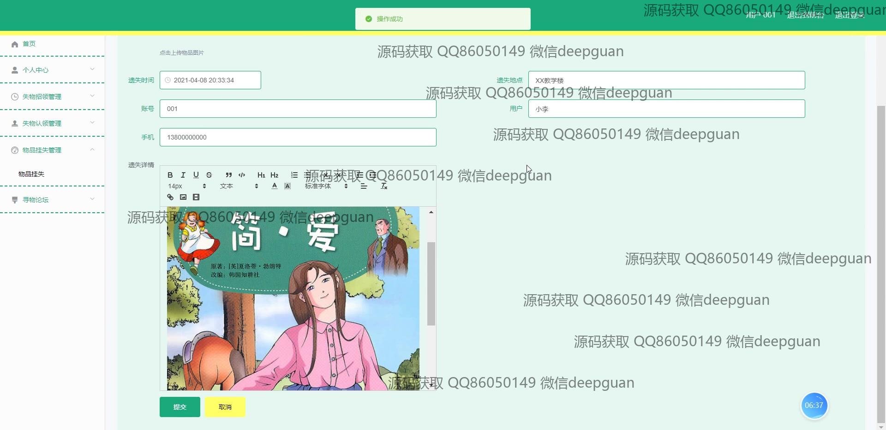

<h1 align="center">基于Java框架失物招领信息交互平台的设计与实现+vue</h1>

## 简介
失物招领信息交互平台：角色分为管理员、用户；主要功能包括用户管理、失物和物品类型管理、招领与挂失管理、寻物论坛、系统管理，有助于高效交流和处理失物招领信息。    --计算机毕业设计源码；毕设源码；java毕业设计源码

## 联系方式

<h3 align="center">获取完整代码与数据库文件 + 微信：deepguan QQ: 86050149 QQ群: 783742310</h3>

<h3 align="center">可帮忙远程部署 包运行成功！提供远程部署、修改代码、设计文档指导、代码讲解等服务！</h3>

## 功能介绍（完整见运行截图）
管理员：提供登录、注册、退出功能；管理用户信息，包括新增、编辑和删除用户；配置物品类别和管理失物招领记录；审核物品招领及挂失申请；查看和管理寻物论坛帖子、用户评论及平台系统设置。

用户：支持注册、登录及退出操作；填写并发布失物或挂失信息，包括上传物品照片和填写物品详情；查看和搜索失物信息列表，进行物品认领或评论互动；管理个人信息，如修改账号、密码及联系方式；在寻物论坛中发布和查看交流信息。

## 运行截图

本代码来源于网络,仅供学习参考使用!

